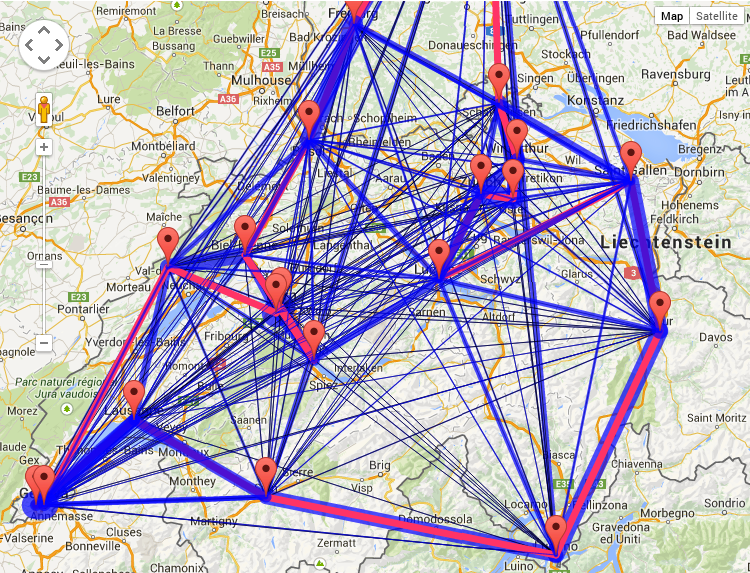

# Thesis for my Federal Vocational Baccalaureate 2013

Use different algorithms to try solving the Travelling Salesman Problem and
visualizing it.



The most interesting part are probably the algorithms:
- tsp.mst.ts
- tsp.twoapprox.ts
- tsp.aoc.ts

## Run it

You need to have Node and Grunt installed.

Install required packages.

```bash
npm install
```

Run grunt buildstep which will host the page at `localhost:8080`.

```
grunt
```
